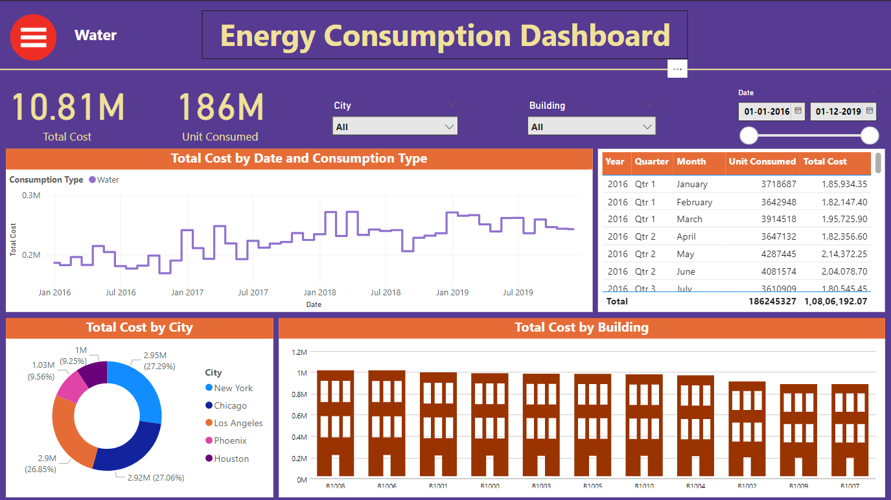
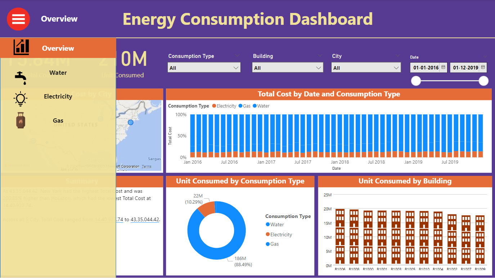
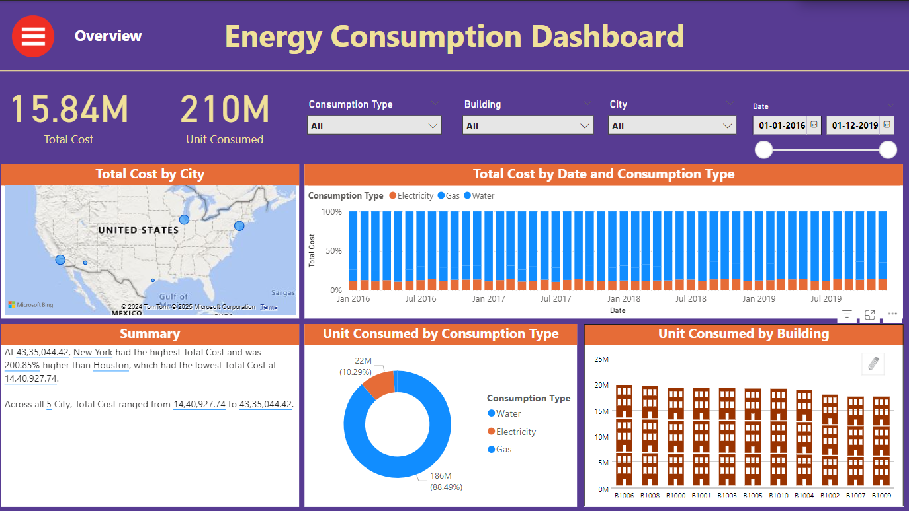

# Energy Consumption Dashboard  

## Description  
A Power BI dashboard analyzing energy consumption data for water, gas, and electricity across multiple cities and buildings. This interactive visualization tool provides:  
- An overview of usage patterns.  
- Detailed insights at the city and building levels.  
- Actionable metrics to support informed decision-making and energy optimization.  

## Key Features  
- **Overview Analysis**: Energy consumption trends for water, gas, and electricity.  
- **Drill-Down Insights**: City and building-specific data exploration.  
- **Dynamic Visualizations**: Bar charts, line graphs, and pie charts for intuitive analysis.  
- **Interactive Slicers**: Filter data by city, building, or energy type.  
- **Simplified Monitoring**: Helps in identifying inefficiencies and improving energy management.  

## Tools and Technologies Used  
- **Power BI Desktop**: For building and designing the dashboard.  
- **Power Query**: For cleaning and transforming raw data.  
- **Dynamic Visualizations**: To present actionable insights.  
- **Interactive Slicers**: For flexible data exploration.  

## How to Use  
1. **Download**: Clone or download the `.pbix` file from this repository.  
2. **Open**: Use Power BI Desktop to open the file.  
3. **Explore**: Interact with the dashboard, using slicers and filters for customized insights.  

## Screenshots  

## Future Scope  
- Integration of real-time data for live monitoring.  
- Addition of predictive analytics for forecasting energy consumption trends.  

## License  
[MIT License](LICENSE)  
This project is licensed under the MIT License - see the `LICENSE` file for details.
